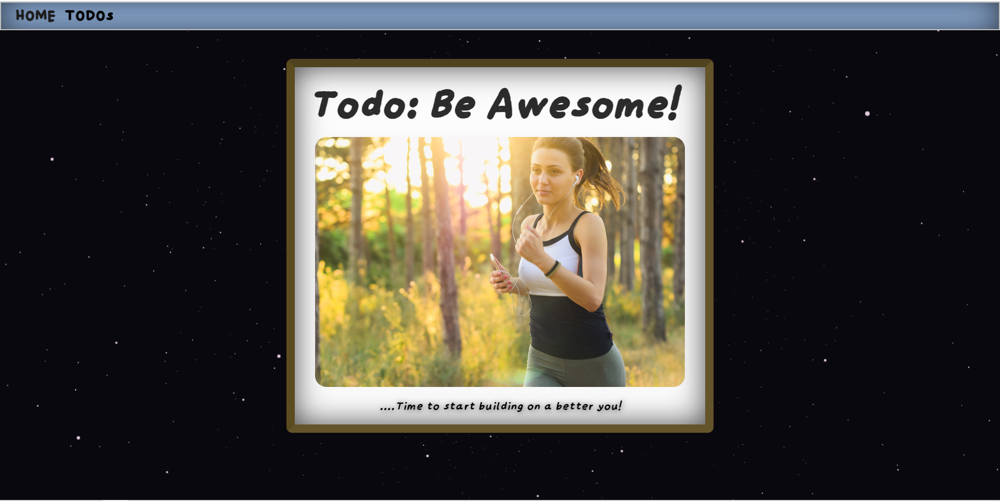
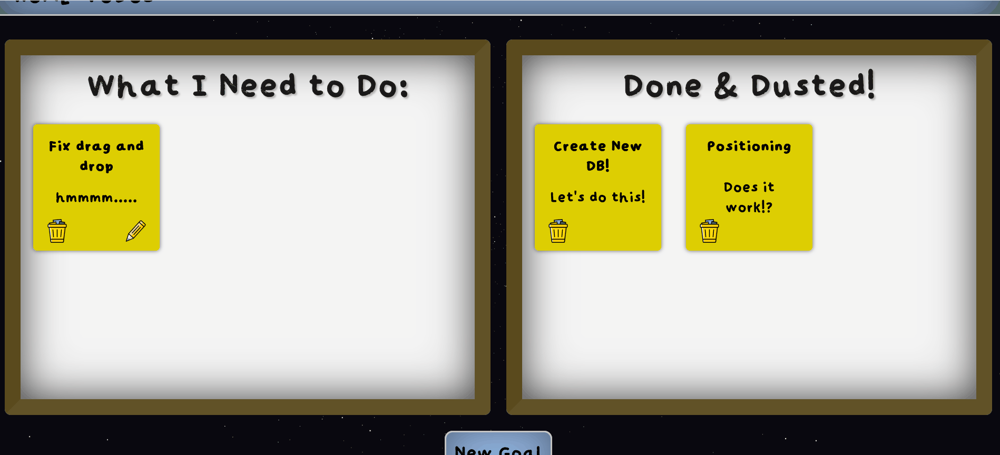
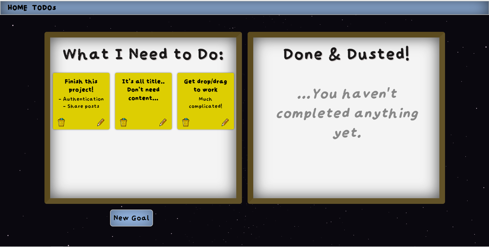
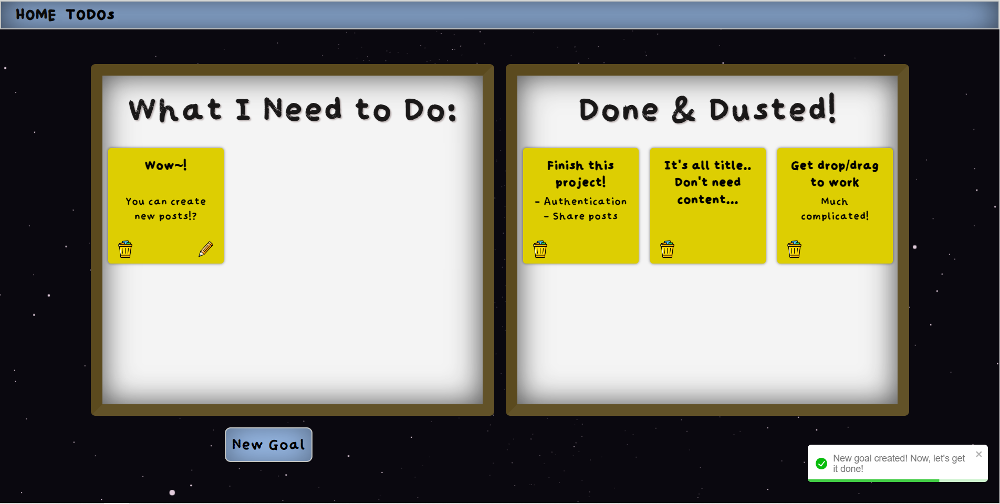
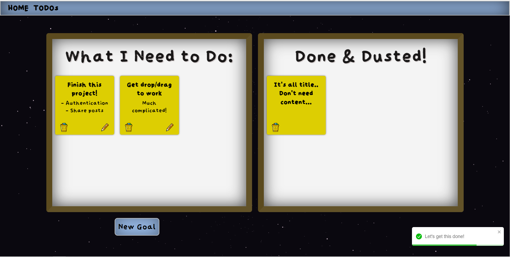
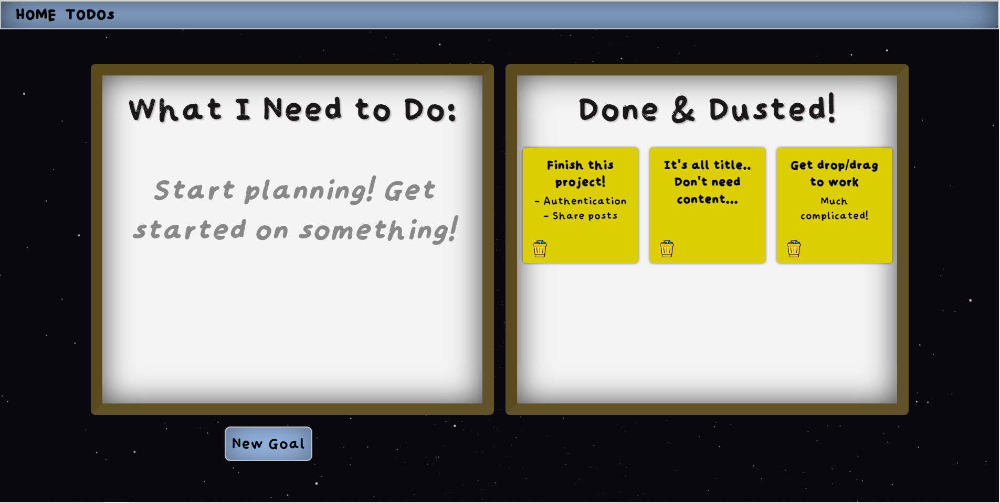

# Todo: Be Awesome - Frontend

This is a simple full-stck to-do app that allows for the user to create new goals with the ability to complete them. It also served as an exercise in practising full-stack development. 

<h1 style="font-weight: 900"> Screenshots </h1>

## 1. Todo: Be Awesome! 



## 2. Organise your goals! 



## 3. So much to get through...



## 4. Create new posts



## 5. Get through goals



## 6. All done! 



## Build Steps

To run this locally, you will need to do the following:

1. Clone to repository to your local machine

```
git clone https://github.com/TimBroderick44/beAwesome-Frontend.git
```

2. Navigate to the location of the directory
```
cd beAwesome-Frontend
```

3. In the above directory, run the below commands:

```bash
npm install
```

```bash
npm run dev
```

## Please keep in mind: 

You will require access to the backend and have access to a database for it to successfully run. The repository to the backend is available here: https://github.com/TimBroderick44/beAwesome-Backend

## What did I use to create it?

This project uses:

-   React
-   TypeScript 
-   SCSS 
-   dndkit (https://dndkit.com/) [for the dragging and dropping of posts]
-   toastify (https://www.npmjs.com/package/react-toastify) [for the creation of toasts]

## Features of the Project:

-  Users are able to create new posts
- Users are able to edit and update existing posts
-  Users are able to delete incomplete or completed posts
-  Users are able to drag posts from the incomplete grid over to the complete grid (and vice versa)
-  Users are able to reposition their posts. 
- Toast notifications are show whenever there is a change (e.g. creation of a post, error handling, etc.)
- Testing has been included so that the application works as intended 

<h1 style="font-weight: 900"> Here are some of the lessons I learnt:</h1>

### Implementing New Libraries:

-  Some libraries like the toastify library are very much 'plug and play' - it requires very little from the developer to have great looking and efficiently functioning toasts. However, libraries like dndkit - while providing incredible functionality - require a lot reading and experimenting. It was a highly rewarding experience and provided my app with an amazing effect; however, there is still so much to learn.

### Linking Frontend with Backend:

- While this isn't my first full-stack app, it was still great practise and assisted in helping me become more fluent in working with both a frontend and a backend. Having control over both the frontend and backend allows for new strategies when implementing them both - e.g. when fetching data, making the decision to perform any logic on the frontend or backend. 

## What I want to include in the future:

## Have more functionality:

-   [ ] Refine the drag and drop functionality 
-   [ ] Allow pagination of posts 
-   [ ] Implement authentication and allow users acceess to their own posts
-   [ ] Allow users to share posts with their friends and collaborate
-   [ ] Improve on the overall styling and aesthetics.


## Thank You!

Thank you for taking the time to look at this project. I really hope you enjoy it.
Feel free to reach out and ask any questions.

[Tim Broderick]
